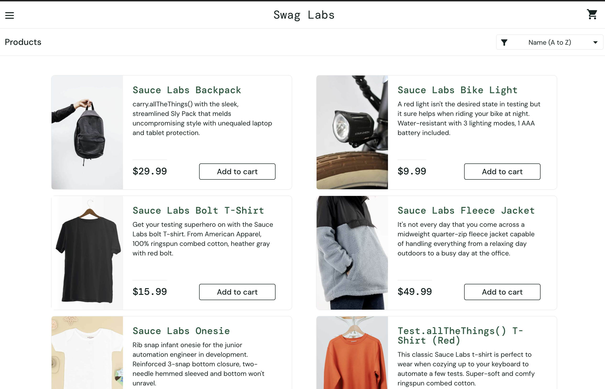
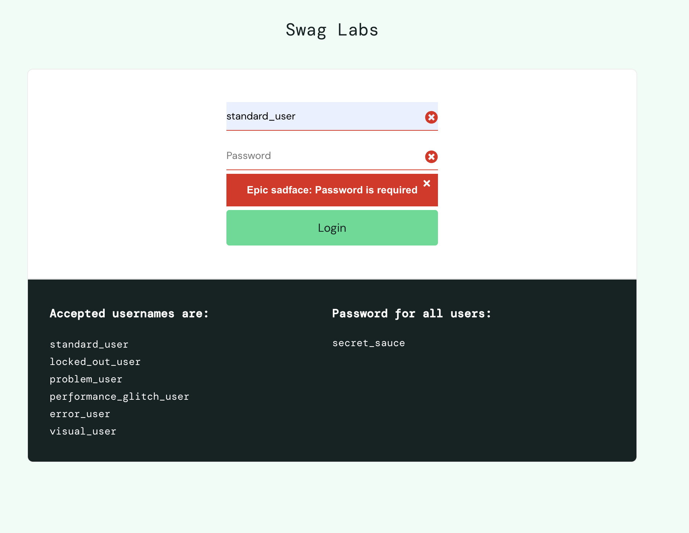
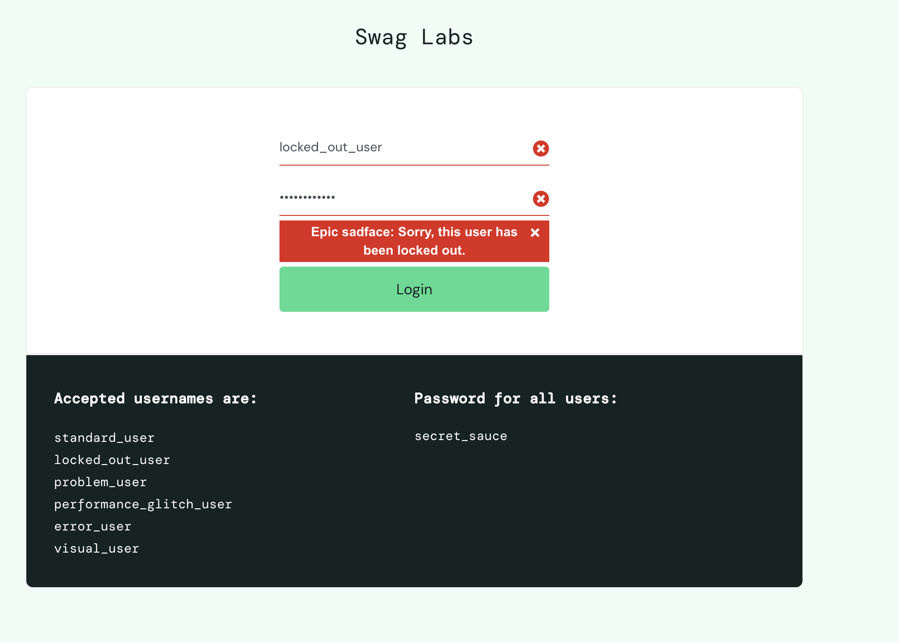

# QA Testing Portfolio

## Project: SauceDemo Login Testing

This repository demonstrates both manual and automated QA testing practices using the SauceDemo application.

The project includes:

* Manual test documentation
* Automated UI testing
* Bug reporting
* Test evidence and screenshots
* Git workflow practices

---

# Tech Stack

* Python
* Selenium WebDriver
* Pytest
* Git & GitHub
* Manual Testing Techniques

---

# Project Structure

```text
qa-practice/
├── README.md
├── .gitignore
├── qa-project/
│   ├── test-plan/
│   ├── test-cases/
│   ├── bug-reports/
│   └── evidence/
└── automation/
    ├── requirements.txt
    ├── tests/
    │   └── test_login.py
    └── utils/
        └── login_helpers.py
```

---

# Testing Scope

The testing scope focuses on validating the login functionality of the SauceDemo application.

## Areas Covered

* Login validation
* Authentication handling
* Error messaging
* UI validation
* Negative testing
* Edge case testing

---

# Test Scenarios Covered

| Scenario                 | Status |
| ------------------------ | ------ |
| Valid login              | Passed |
| Invalid password         | Passed |
| Locked user validation   | Passed |
| Empty username           | Passed |
| Empty password           | Passed |
| Error message validation | Passed |
| Special character input  | Passed |

---

# Manual QA Deliverables

* Test Plan
* Test Cases
* Bug Reports
* Test Evidence
* Screenshots

---

# Automation Coverage

Automated UI tests were developed using Selenium and Pytest.

## Automated Test Examples

* Successful login
* Invalid credentials
* Locked user login
* Empty field validation
* Error message assertions

---

# Example Bug Report

## Bug: Login Allows Empty Password Submission

### Steps to Reproduce

1. Navigate to login page
2. Enter valid username
3. Leave password field empty
4. Click Login

### Expected Result

An error message should prevent login submission.

### Actual Result

The login attempt proceeds without proper validation.

### Severity

Medium

---

# Git Workflow

* Created feature branches
* Added test documentation
* Committed incremental changes
* Opened Pull Requests
* Merged changes into main branch

---

# Evidence

## Successful Login



## Password Required Error



## Locked User Error



---

# Future Improvements

* Page Object Model (POM)
* Cross-browser testing
* API testing
* CI/CD integration
* GitHub Actions automation
* Test reporting dashboards
